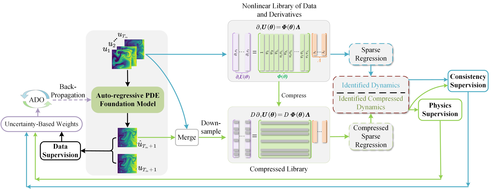

# Physics-informed Temporal Alignment for Auto-regressive PDE Foundation Models (ICML 2025)

Official Pytorch implementation for our ICML2025 submission "Physics-informed Temporal Alignment for Auto-regressive PDE Foundation Models".
> [arXiv:2505.10930](http://arxiv.org/abs/2505.10930)  
>   
> **[Introduction Video](https://drive.google.com/file/d/1NXiaAj7s-86K_GgwWNPulsDpfYhJPMqd/view?usp=sharing)**





 The proposed framework integrates auto-regressive prediction and PDE discovery with self-supervised learning:

- (1) The pretrained PDE model takes the initial temporal states as input and predicts future states as output in an auto-regressive manner;
- (2) Data-driven PDE discovery is then performed on the compressed input sequence to infer the governing equations. 
Temporal alignment is achieved by matching the discovered physical laws from predictions with those obtained from the ground truth sequence;
- (3) The loss function consists of three parts, i.e., data loss, physics loss and consistency loss, with an uncertainty-based strategy employed to adjust the weights dynamically.

For any questions regarding our paper or this repository, please feel free to contact us at xxy1101@mail.ustc.edu.cn.
## Datasets

All datasets are stored using hdf5 format, containing data field. Below is a table list of the datasets used in our paper.

| Dataset              | Description                                       | Link                                                    |
| -------------------- | ------------------------------------------------- | ------------------------------------------------------- |
| **FNO data**         | Data used for Fourier Neural Operator experiments | [Download](https://drive.google.com/drive/folders/1UnbQh2WWc6knEHbLn-ZaXrKUZhp7pjt-)                                        |
| **PDEBench data**    | Benchmark datasets for PDE solvers                | [Download](https://darus.uni-stuttgart.de/dataset.xhtml?persistentId=doi:10.18419/darus-2986)                                        |
| **PDEArena data**    | Large-scale PDE simulation suite                  | [Download](https://huggingface.co/pdearena)             |
| **CFDbench data**    | Computational Fluid Dynamics benchmarks           | [Download](https://huggingface.co/datasets/chen-yingfa/CFDBench-raw) |
| **Burgers Equation** | Data for Burgers’ equation experiments            | [Download](https://drive.google.com/drive/folders/1LA5qTo0lUlpqFVspHV7I5Osr8ZaiuRSJ) |

###  Coordinate Bounds

Each dataset has spatial-temporal bounds used for normalization and inverse modeling, provided by:

```python
get_grid_bound_2D(dataset: str, T_ar: int = 10) -> tuple
```

This returns `(x_max, y_max, t_max, x_min, y_min, t_min)` for the domain.

###  Preprocessing Notes

All datasets are preprocessed using the `preprocess.py` script from the DPOT repository ([link](https://github.com/HaoZhongkai/DPOT/blob/main/data_generation/preprocess.py)).  
The resulting data is structured as a 5D tensor with shape `[B, H, W, T, C]`, where:

- `B` denotes the batch size,  

- `H` and `W` represent the spatial resolution along the X and Y dimensions respectively,  

- `T` is the temporal length, 

- `C` is the number of physical variables in the dataset.


## Running the Experiments

### Requirements

- Python 3.9.19
- torch 2.0.1
- torchvision 0.15.2
- torchaudio 2.0.2
- einops 0.8.0
- numpy 1.26.4
- accelerate 0.23.0

### Environment Setup

**Recommended: Conda**

If you're familiar with Conda, you can quickly set up the environment using:

```bash
git clone https://github.com/SCAILab-USTC/PITA.git
cd PITA
conda env create -f environment.yaml
conda activate PITA
```

**Alternative: Pip**

If you prefer pip, install dependencies using:

```bash
git clone https://github.com/SCAILab-USTC/PITA.git
cd PITA
pip install -r requirements.txt
```

### Quick Start

#### DPOT 

To train PITA on DPOT model, simply run the following command:

```bash
## Complete Training Command

python train_pita.py \
--gpu 7 \
--model DPOT \
--epochs 500 \
--time_cut 3 \
--resume_path "" \
--train_paths burgers \
--test_paths burgers \
--ntrain_list 1000 \
--lr_method cycle \
--patch_size 8 \               # Patch size for spatial decomposition
--width 512 \                  # Embedding dimension (hidden layer size)
--modes 16 \                   # Fourier modes for FNO layer
--n_layers 6 \                 # Total depth of the network
--n_blocks 3 \                 # Number of residual blocks
--mlp_ratio 1.0 \             # Expansion ratio in MLP layers
--batch_size 20 \              # Training batch size
--time_cut 3 \				  # number of frame to be retained  
--batch_down 10 \             # Downsampling ratio for samples (e.g. batch_size=40 → retained=40/10=4)
--grid_xy 4 \                 # Downsampling ratio for spatial grid axes (e.g. resolution=128 → 128/4=32)
```

#### FNO

To train PITA on FNO model, simply run the following command:

```bash
## Complete Training Command

python train_pita.py \
--gpu 6 \
--epochs 500 \
--model FNO \
--time_cut 3 \
--resume_path "" \
--train_paths swe_pdb \
--test_paths swe_pdb \
--ntrain_list 900 \
--lr_method cycle \
--patch_size 1 \               # Patch size for spatial decomposition
--width 512 \                  # Embedding dimension (hidden layer size)
--modes 16 \                   # Fourier modes for FNO layer
--n_layers 4 \                 # Total depth of the network
--batch_size 20 \              # Training batch size
--time_cut 3 \				  # number of frame to be retained  
--batch_down 10 \             # Downsampling ratio for samples (e.g. batch_size=40 → retained=40/10=4)
--grid_xy 4 \                 # Downsampling ratio for spatial grid axes (e.g. resolution=128 → 128/4=32)
```


## Project Structure

**Repository Overview**  
This repository contains code for training and evaluating the **PITA** framework on various PDE-based models (DPOT, FNO, MPP). Below is the detailed directory structure:

### Core Files
- `README.md`  
  - Project documentation and usage guide
- `train_pita.py`  
  - **Main training script** for PITA on DPOT and FNO models
- `train_pita_mpp.py`  
  - **Training script** for PITA on the MPP model
- `solve_coef.py`  
  - Module for **solving PDE coefficients** from input data
- `test_function/`  
  - Test scripts for **model evaluation and validation**

### Utils Package (`utils/`)
- `criterion.py`  
  - Custom **loss functions** (e.g., relative error metrics)
- `griddataset.py`  
  - Dataset handler for **temporal-spatial grid data** (mixture distributions)
- `make_master_file.py`  
  - Dataset config file
- `optimizer_utils.py`  
  - Implementations of **optimizers and learning rate schedulers**
- `Stridge.py`  
  - Core logic for **PDE discovery algorithms**
- `grid.py`  
  - Spatial/temporal boundary definitions for **2D datasets**
- `utilities.py`  
  - Helper functions for data I/O and visualization
- `AutomaticWeightedLoss.py`  
  - Adaptive loss weighting via **uncertainty-based optimization**

### Configurations ( `config/`)
- **Training Parameters**
  - `mpp.py`, `mpp_params.py`  
    - Hyperparameter configurations for **MPP model training**
  - `dpot.py`  
    - Training configurations for **DPOT and FNO models**

### Model Implementations (`models/`)
- `dpot.py`  
  - Implementation of the **DPOT architecture**
- `fno.py`  
  - **Fourier Neural Operator (FNO)** variant with group normalization

### Key Features
✅ Unified framework for **PDE-informed training**  
✅ Supports multiple architectures (DPOT/FNO/MPP)  
✅ Adaptive loss weighting strategy  
✅ Temporal-spatial grid dataset management  
✅ Automated coefficient solving for PDE terms  

*All code follows modular design principles for easy extension.*


### Acknowledgement

We gratefully acknowledge the DPOT project for providing the data preprocessing pipeline utilized in our study (https://github.com/HaoZhongkai/DPOT/blob/main/data_generation/preprocess.py). Furthermore, we sincerely thank the authors of the AutomaticWeightedLoss repository (https://github.com/Mikoto10032/AutomaticWeightedLoss/tree/master) for their implementation of the uncertainty-based automatic loss weighting strategy, which was adapted for our experiments. Their contributions and commitment to open-source research have been instrumental to our work.

<p align="center" style="font-size:small; color:gray;">
I would like to express my sincere gratitude to my friend Xiaoxiang Wu, who is currently pursuing her Master's degree, for her generous help in recording the introduction video.
</p>

